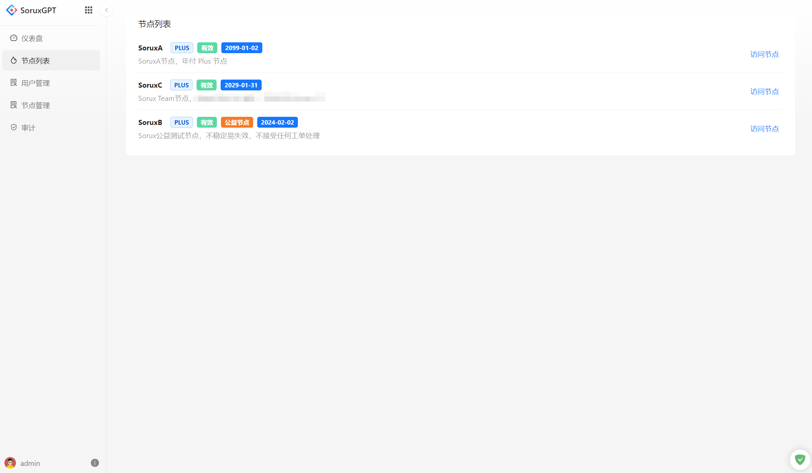
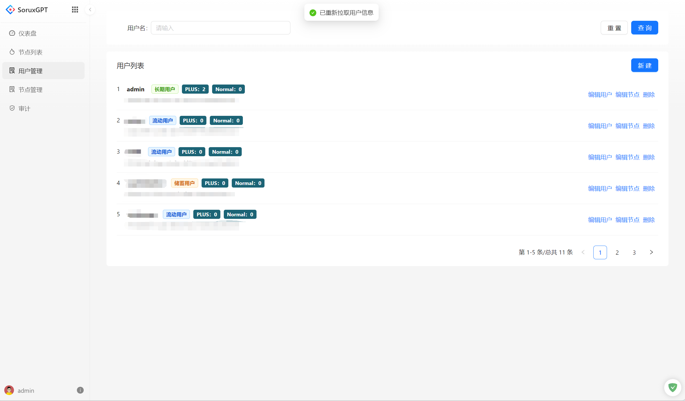
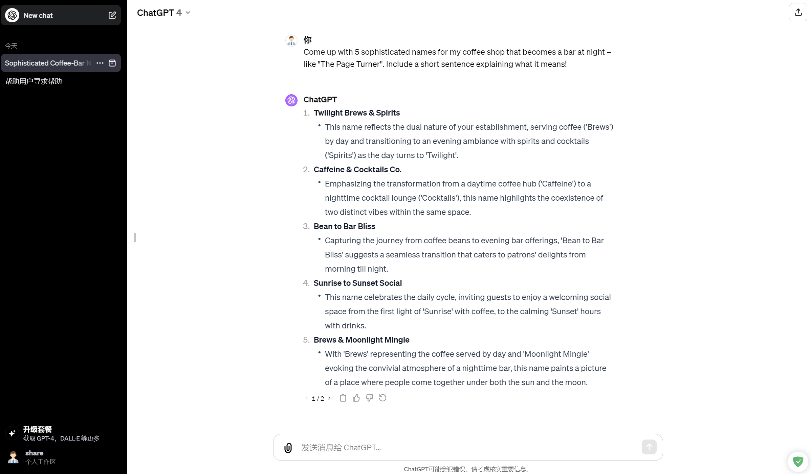

# Sorux-GPT-Panel
SoruxGPT 面板管理，支持多号多节点 ChatGPT 共享管理。  

特别注意：本 Panel 不允许任何未经许可的商业化授权，社区版本不允许节点数大于等于 2，用户大于等于 10。如果需要商业化授权请联系 epicmocn@gmail.com。  

## Docker 镜像部署
> 以下为社区版本的镜像资源。特别注意：社区版本比商业版本阉割了部分内容。  

> 如果需要搭建帮助，可以有偿联系 epicmocn@gmail.com。

```bash
docker pull epicmo/sorux_user:v15
```

## 部署文档

正在敲，等 Star 多一点估计就出来了）

> 因为是闭源转免费开源，文档没跟上

## Feature

- 节点管理：支持多个节点的调度管理
- 用户管理：支持用户管理
- 聊天审计：支持聊天内容审计，关键词检查
- 速率限制：支持对用户单独限速，对节点限速
- 聊天汇总查看：支持后台查看全部消息记录
- 内置虚拟货币系统：支持内置虚拟货币系统
- 等等...

## 截图






