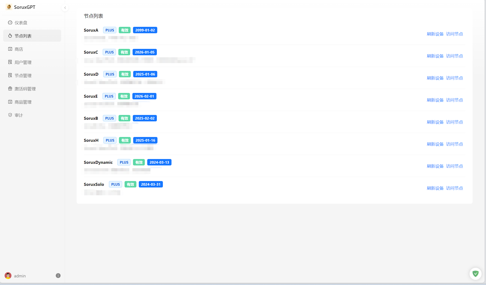

# Sorux-GPT-Panel
SoruxGPT 面板管理，支持多号多节点 ChatGPT 共享管理。

若有兴趣，致信 epicmocn@gmail.com 联系。

## Docker 镜像
注：具体的标签请自己在 Docker Hub 中搜索   
如果需要提供指导，可以有偿通过联系邮箱~  
```bash
docker pull epicmo/sorux_user:v15
```

## Feature

- 节点管理：支持多个节点的调度管理
- 用户管理：支持用户管理
- 聊天审计：支持聊天内容审计，关键词检查
- 速率限制：支持对用户单独限速，对节点限速
- 聊天汇总查看：支持后台查看全部消息记录
- 内置虚拟货币系统：支持内置虚拟货币系统
- 等等...

## 截图





