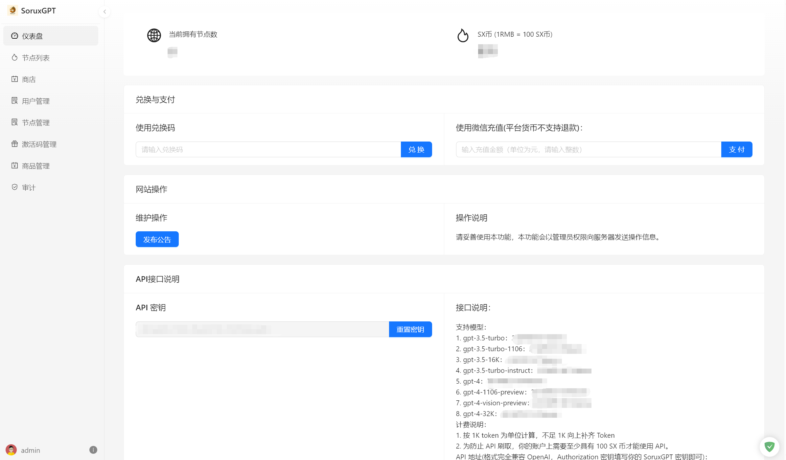

# Sorux-GPT-Panel
SoruxGPT 面板管理，支持多号多节点 ChatGPT 共享管理。  

交流群：168626495  

特别注意：本 Panel 不允许任何未经许可的商业化授权，如果需要商业化授权请联系 epicmocn@gmail.com。  

## Docker 镜像部署
> 以下为社区版本的镜像资源。特别注意：社区版本比商业版本阉割了部分内容。  

> 如果需要搭建帮助，可以有偿联系 epicmocn@gmail.com。

```bash
docker pull epicmo/soruxgpt_community:latest
```

## 部署文档

请访问网站：[SoruxGPT Docs](https://liaosunny123.github.io/SoruxGPT-Docs/)

## Feature

- 节点管理：支持多个节点的调度管理
- 用户管理：支持用户管理
- 聊天审计：支持聊天内容审计，关键词检查
- 速率限制：支持对用户单独限速，对节点限速
- 聊天汇总查看：支持后台查看全部消息记录
- 兑换码系统：对接兑换码系统
- 商店系统：允许用户购买商品
- 内置虚拟货币系统：支持内置虚拟货币系统
- 等等...

## 基于面板你可以做的事情

- 给每个用户单独设置消息速率
- 给每个节点设置是否公益，是否限速，是否是 Plus
- 提供违禁词列表进行审查
- 通过虚拟货币和 API 对接发卡网或者你自己的商店逻辑
- 给每个用户分配单独的节点（如果你是车队那就全部分配节点，如果你是独购那就分配一个单独的节点）
- 等等，可以完成市面上基本上全部的 GPT 面板的运营逻辑

## 截图
> 注意：这些截图并非最新的
  



## 社区版限制

- 用户数不能超过10
- 节点数不能超过2
- 不支持设备数限制
- 不支持违禁提问检查
- 不支持按用户单独限制消息频率
- 只支持创建公益节点
- 不支持统计 API
- 不支持审计
- 等等
